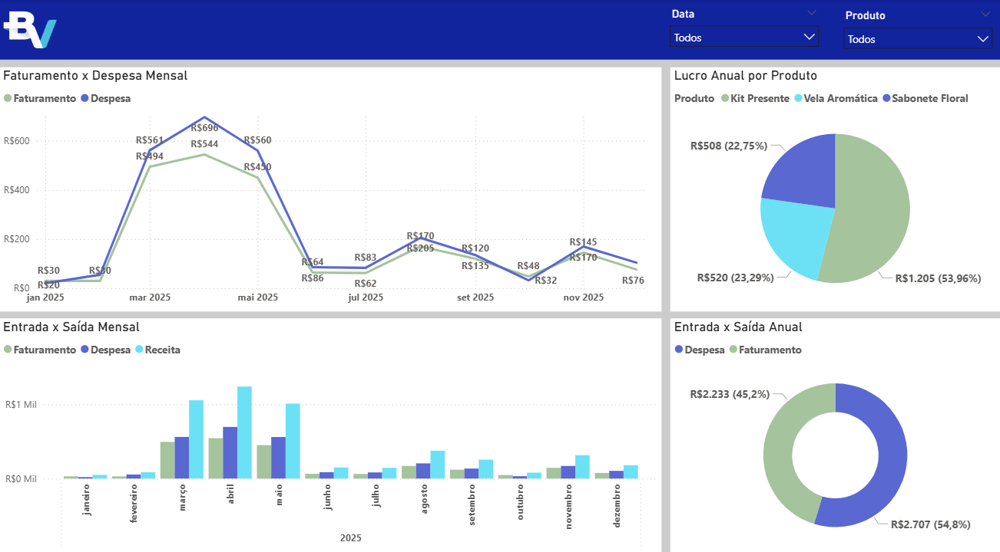

# 🚀 Dashboard de Performance - Empoderamento Feminino

> [cite_start]**Desafio Online Geral - Programa de Estágio Elas por Elas no Banco BV** [cite: 1, 4]

[cite_start]Este projeto apresenta uma solução tecnológica para combater a invisibilidade financeira da mulher empreendedora no Brasil[cite: 5, 6]. [cite_start]Através de um dashboard intuitivo, a proposta transforma dados brutos em autonomia, permitindo a gestão completa de KPIs e o planejamento estratégico para pequenos negócios[cite: 10, 12].

## Sumário
- [Tecnologias](#tecnologias)
- [Funcionalidades](#funcionalidades)
- [Observação sobre os Dados](#-observação-sobre-os-dados)
- [Visualização](#visualização)
- [Licença](#licença)

---

## Tecnologias
- [cite_start]**Microsoft Power BI**: Desenvolvimento do dashboard e modelagem de indicadores[cite: 2, 24].
- [cite_start]**Análise de Dados**: Definição de métricas baseadas em dados do Sebrae e Banco Central[cite: 19, 20, 21].
- [cite_start]**UI/UX Design**: Interface intuitiva focada em democratizar a gestão digital[cite: 10, 14].

---

## Funcionalidades
- [cite_start]**Gestão Financeira Completa**: Monitoramento de faturamento, despesas e margem de lucro[cite: 10, 39].
- [cite_start]**Análise de Rentabilidade**: Identificação de produtos mais lucrativos através do Lucro Anual por Produto[cite: 29].
- [cite_start]**Acompanhamento de Metas**: Comparativo entre vendas reais, visitas ao site e seguidores vs. metas[cite: 41, 44, 45].
- [cite_start]**Visão de Fluxo de Caixa**: Gráficos de entrada e saída mensal/anual para controle de saúde financeira[cite: 18, 35, 36].

---

## Observação sobre os Dados
[cite_start]Os dados apresentados neste dashboard são **estritamente fictícios**[cite: 16, 17]. [cite_start]Eles foram gerados para ilustrar cenários reais de uso e demonstrar as funcionalidades de cálculo de KPIs, sem conter informações sensíveis de terceiros ou do Banco BV[cite: 13, 16, 17].

---

## Visualização
[cite_start]O design foi projetado para ser intuitivo, facilitando a tomada de decisão para empreendedoras que operam na informalidade[cite: 14, 23].

---

## Licença
**MIT License**

Copyright (c) 2026 Jéssica Cristina de Rezende

[cite_start]Este projeto foi desenvolvido originalmente para o desafio do programa de estágio Elas por Elas do Banco BV[cite: 1, 4].
