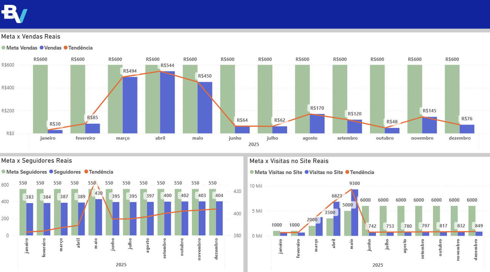

# 🚀 Dashboard de Performance - Empoderamento Feminino 
> **Desafio Online Geral - Programa de Estágio Elas por Elas no Banco BV**
> Status do Projeto: Concluído

Este projeto apresenta uma solução tecnológica para combater a invisibilidade financeira da mulher empreendedora no Brasil. Através de um dashboard intuitivo, a proposta transforma dados brutos em autonomia, permitindo a gestão completa de KPIs e o planejamento estratégico para pequenos negócios.

## Sumário
- [Tecnologias](#tecnologias)
- [Funcionalidades](#funcionalidades)
- [Observação sobre os Dados](#-observação-sobre-os-dados)
- [Visualização](#visualização)
- [Licença](#licença)

---

## Tecnologias
- **Microsoft Power BI**: Desenvolvimento do dashboard e modelagem de indicadores.
- **Análise de Dados**: Definição de métricas baseadas em dados do Sebrae e Banco Central.
- **UI/UX Design**: Interface intuitiva focada em democratizar a gestão digital.

---

## Funcionalidades
- **Gestão Financeira Completa**: Monitoramento de faturamento, despesas e margem de lucro.
- **Análise de Rentabilidade**: Identificação de produtos mais lucrativos através do Lucro Anual por Produto.
- **Acompanhamento de Metas**: Comparativo entre vendas reais, visitas ao site e seguidores vs. metas.
- **Visão de Fluxo de Caixa**: Gráficos de entrada e saída mensal/anual para controle de saúde financeira.

---

## Observação sobre os Dados
Os dados apresentados neste dashboard são **estritamente fictícios**. Eles foram gerados para ilustrar cenários reais de uso e demonstrar as funcionalidades de cálculo de KPIs, sem conter informações sensíveis de terceiros ou do Banco BV.

---

## Visualização
O design foi projetado para ser intuitivo, facilitando a tomada de decisão para empreendedoras que operam na informalidade.

---

## Licença
**MIT License**

Copyright (c) 2026 Jéssica Cristina de Rezende

Este projeto foi desenvolvido originalmente para o desafio do programa de estágio Elas por Elas do Banco BV.
